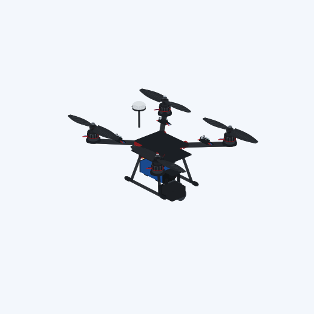
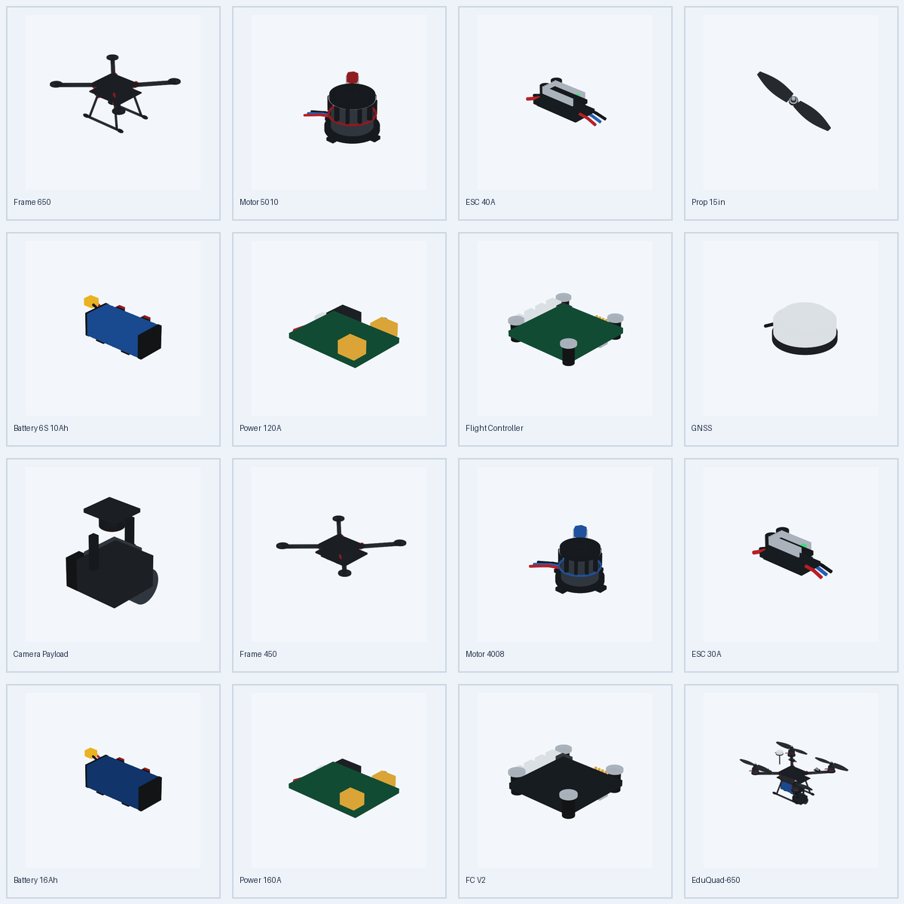
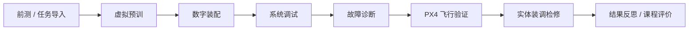
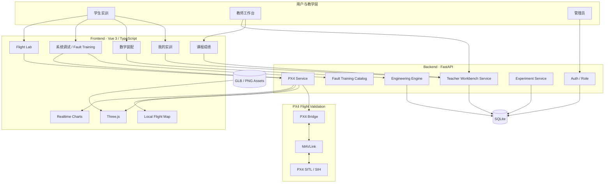

<div align="center">

# UAV Studio

### 无人机装调检修数字化实训与教学管理平台

**Assemble · Debug · Diagnose · Validate · Teach**

面向无人机装调检修课程，将 **数字装配、工程校核、系统调试、故障诊断、起飞前检查、PX4 飞行验证与课程教学管理** 连接成一条完整实训链路。

</div>

<p align="center">
  
</p>

<p align="center">
  <strong>组件库 → 3D 数字装配 → 工程校核 → 系统调试 → 故障实训 → Pre-Arm → PX4 SIH 飞行验证 → TrainingRun → 教师成绩册</strong>
</p>

---

## 项目定位

UAV Studio 不是单纯的无人机 3D 展示器，也不是只用于“把飞机飞起来”的模拟器。

它聚焦于无人机专业中一个更基础、更工程化的问题：

> **如何让学生理解一架无人机是怎样被正确组装、调试、检查、排故并最终验证可飞的？**

平台围绕《无人机装调检修》等实践课程，把传统实体实训中难以反复设置、试错成本较高、过程不易记录的内容前移到数字环境中，形成：

```text
装 → 调 → 检 → 修 → 验
```

教学定位不是替代实体无人机，而是：

> **虚拟练诊断，实体练操作；虚拟可反复，实体验能力。**

---

## 当前完整实训链路

```mermaid
flowchart LR
    A[组件库] --> B[3D 数字装配]
    B --> C[工程参数校核]
    C --> D[飞控与传感器调试]
    D --> E[遥控系统调试]
    E --> F[动力系统调试]
    F --> G[安全参数配置]
    G --> H[故障诊断]
    H --> I[Pre-Arm / 起飞前检查]
    I --> J[PX4 SIH 飞行验证]
    J --> K[TrainingRun / TrainingEvent]
    K --> L[教师工作台 / 课程成绩]
```



学生不再只完成一个孤立实验，而是从数字样机开始，逐步经历完整的工程调试过程。

---

# 核心能力

## 1. 数字装配与工程校核

UAV Studio 使用统一的组件数据与 GLB / PBR 资产构建无人机数字样机。

当前主要组件包括：

`Frame` · `Motor ×4` · `ESC ×4` · `Propeller ×4` · `Battery` · `Power Module` · `Flight Controller` · `GNSS` · `Payload`

<p align="center">
  
</p>

平台支持：

- M1–M4 独立安装语义；
- CW / CCW 螺旋桨方向约束；
- 三维组件选择、高亮与爆炸视图；
- 质量、重心、惯量估算；
- 最大推力与推重比；
- 悬停油门；
- 最大电流 / 功率；
- 电池持续放电裕量；
- ESC / Power Module 电流裕量；
- 预计续航；
- 载荷质量比例；
- 电压兼容性；
- 电机 + 螺旋桨 + 电池性能曲线匹配。

装配完成并不意味着“可飞”，系统会继续要求学生完成工程检查与后续调试。

---

## 2. 系统调试工作台

系统调试是当前平台的核心教学区域。

```text
飞控与传感器
      ↓
遥控系统
      ↓
动力系统
      ↓
安全设置
      ↓
起飞前检查
```

### 飞控与传感器

支持观察和训练：

- IMU；
- Magnetometer；
- Barometer；
- GNSS；
- EKF / 状态估计；
- 校准状态；
- PX4 传感器健康状态。

### 遥控系统

支持：

- RC 通道实时显示；
- Roll / Pitch / Yaw / Throttle 映射；
- 通道方向；
- 行程与中位值；
- PX4 RC_CHANNELS / 虚拟教学输入。

### 动力系统

支持：

- M1–M4 独立电机测试；
- 电机映射检查；
- CW / CCW 方向关系；
- 执行机构响应验证；
- 三维模型同步反馈。

### 安全设置

用于训练：

- RC Loss；
- Battery Failsafe；
- RTL；
- Geofence；
- 关键 PX4 安全参数；
- Pre-Arm 条件检查。

---

## 3. 故障诊断实训

平台不是通过“红灯 → 点击修复”来完成故障教学，而是要求学生使用正常调试工具完成：

```text
故障现象
   ↓
选择检查模块
   ↓
查看状态 / 执行测试
   ↓
判断原因
   ↓
参数或配置修复
   ↓
重新测试
   ↓
Pre-Arm
   ↓
飞行验证
```

当前内置典型案例：

| ID | 案例 | 难度 |
| --- | --- | --- |
| F01 | 罗盘状态异常 | ★ |
| F02 | RC Roll 方向异常 | ★ |
| F03 | RC 主通道映射错误 | ★★ |
| F04 | M1 / M3 电机映射错误 | ★★ |
| F05 | Failsafe 配置异常 | ★★ |
| F06 | 综合 Pre-Arm 故障 | ★★★ |

案例过程中记录：

- 完成时间；
- 访问过的调试模块；
- 错误操作次数；
- 提示使用次数；
- 成功条件；
- 提交次数；
- Pre-Arm 状态；
- 飞行验证结果；
- 最终成绩。

---

## 4. PX4 SIH 飞行验证

UAV Studio 已接入真实 PX4 飞控软件仿真链路：

```text
UAV Studio
    ↓
FastAPI / PX4 Bridge
    ↓
MAVLink
    ↓
PX4 SITL / SIH
```

PX4 负责真实飞控逻辑和飞行状态，UAV Studio 负责教学化调试、三维数字孪生显示和过程评价。

平台支持：

- Heartbeat / Bridge 状态；
- Arm / Disarm；
- Takeoff；
- Hover；
- Land；
- PX4 参数读取 / 写入；
- 实时姿态、位置、电池、电机输出；
- Three.js 三维飞行；
- Local Flight Map；
- 实时遥测曲线。

课程任务中的飞行验证要求观察完整序列：

```text
起飞 → 进入悬停 → 执行降落 → 返回地面
```

只有完整序列成立后，系统才把飞行验证写入 TrainingRun。

> 当前平台定位是装调检修教学，不追求高保真空气动力学仿真。PX4 SIH 用于飞控逻辑、参数、状态与基础飞行验证。

---

# 教学平台能力

## 5. 用户角色与权限

平台当前支持：

```text
admin
  ├── 用户与教师角色管理
  ├── 教师工作台全部功能
  └── 系统管理

teacher
  ├── 创建班级
  ├── 发布实训任务
  ├── 查看 TrainingRun / TrainingEvent
  ├── 查看课程成绩
  └── 查看班级学习分析

student
  ├── 加入班级
  ├── 接收实训任务
  ├── 完成装调检修训练
  └── 查看自己的任务结果
```

普通注册账号始终默认为 `student`，教师身份由管理员设置，不能由用户自行注册获得。

---

## 6. 教师工作台

教师登录后，顶部导航在“系统设置”前显示 **教师工作台**。

当前包含：

### 教学总览

- 班级数；
- 学生数；
- 进行中任务；
- 已完成实训；
- 平均成绩；
- 最近任务完成情况。

### 班级管理

教师可以创建教学班并生成邀请码：

```text
23无人机1班
邀请码：UAV-XXXXXX
```

学生通过邀请码加入班级。

### 实训任务

教师可以从故障案例库发布任务并设置：

- 班级；
- 案例；
- 任务说明；
- 截止时间；
- 是否要求 Pre-Arm；
- 是否要求飞行验证；
- 成绩权重。

---

## 7. TrainingRun / TrainingEvent

平台正式建立了课程过程数据链：

```text
Classroom
   ↓
Assignment
   ↓
TrainingRun
   ↓
TrainingEvent
```

### TrainingRun

记录一名学生一次完整实训：

- 学生；
- 任务；
- 使用飞机；
- 案例；
- 开始 / 结束时间；
- 当前阶段；
- 案例成绩；
- 提示；
- 错误操作；
- Pre-Arm；
- Flight Validation；
- 最终课程成绩。

### TrainingEvent

记录过程中的关键操作，例如：

```text
09:08:21 进入动力系统
09:08:43 测试 M1
09:08:45 实际响应 M3
09:09:17 查看执行机构映射
09:10:32 修改参数
09:10:45 再次测试 M1
09:10:47 M1 响应正确
```

教师看到的不再只是“82 分”，而是能够了解学生为什么得到这个成绩。

---

## 8. 实训全过程状态机

Teacher Workbench V2 将课程任务扩展为完整状态机：

```text
故障诊断中
    ↓
等待 Pre-Arm
    ↓
等待飞行验证
    ↓
已完成 / 成绩锁定
```

对于要求飞行验证的任务，诊断通过不会直接结束 TrainingRun。

已完成任务具有幂等保护，复盘和后续操作不会覆盖正式成绩。

---

## 9. 课程成绩管理

默认成绩结构：

```text
故障案例成绩      70%
飞行验证          20%
规范操作          10%
```

其中规范操作采用可解释规则：

```text
规范操作分 = 100 - 提示次数 × 10 - 错误操作次数 × 5
```

最低为 0 分。

若教师没有启用飞行验证，系统只对实际启用的评价维度重新归一，不会因为未启用模块导致学生失分。

教师端提供：

- 学生 × 实训任务成绩矩阵；
- 班级平均分；
- 完成率；
- 首次通过率；
- 平均用时；
- 平均错误操作次数；
- 飞行验证率；
- 单任务完成率 / 均分 / 首次通过率；
- UTF-8 BOM CSV 成绩导出，可直接由 Excel 打开。

---

# 教学模式

UAV Studio 推荐嵌入实体课程，而不是独立替代实体训练。



对应能力分工：

| 虚拟环境 | 实体环境 |
| --- | --- |
| 系统认知 | 机械安装 |
| 参数判断 | 接线与焊接 |
| 调试逻辑 | 工具使用 |
| 故障诊断 | 真实设备操作 |
| 可重复试错 | 工程规范与安全 |
| 过程记录 | 实体技能验证 |

---

# 系统架构



---

# 技术栈

| Layer | Stack |
| --- | --- |
| Frontend | Vue 3 · TypeScript · Vite |
| UI | Element Plus |
| State | Pinia |
| 3D | Three.js · GLB / glTF 2.0 · PBR |
| Charts | ECharts |
| Backend | FastAPI · Pydantic |
| Engineering | NumPy + Python |
| Persistence | SQLAlchemy · SQLite |
| Realtime | WebSocket · MAVLink |
| Flight Control | PX4 SITL / SIH |
| Test | pytest · Vitest · E2E / Contract Tests |

---

# 数据模型

```text
UserRecord
├── role: admin / teacher / student
└── AircraftRecord × N

ClassroomRecord
├── teacher_user_id
└── ClassEnrollmentRecord
        └── student_user_id

AssignmentRecord
├── class_id
├── scenario_id
├── requirements
└── score_weights

TrainingRunRecord
├── student_user_id
├── assignment_id
├── aircraft_id
├── status
├── score
├── hints_used
├── wrong_operations
├── prearm_passed
├── flight_validation_passed
└── result_json

TrainingEventRecord
├── run_id
├── event_type
├── title
├── detail
└── payload_json
```

---

# 项目结构

```text
uav-studio/
├── backend/
│   ├── auth.py
│   ├── engineering.py
│   ├── teacher_workbench.py
│   ├── training/
│   ├── px4/
│   ├── px4_service.py
│   ├── simulator.py
│   └── ...
│
├── frontend/
│   ├── src/
│   │   ├── views/
│   │   │   ├── Assembly.vue
│   │   │   ├── Debugging.vue
│   │   │   ├── FlightLab.vue
│   │   │   ├── MyTraining.vue
│   │   │   └── TeacherWorkbench.vue
│   │   ├── components/
│   │   ├── stores/
│   │   ├── utils/
│   │   └── three/
│   └── public/
│       ├── models/uav/
│       └── training/scenarios/
│
├── tests/
├── docs/
├── deploy/
├── scripts/
└── tools/
```

---

# 快速开始

## Backend

```bash
python -m venv .venv

# Windows
.venv\Scripts\activate

# macOS / Linux
source .venv/bin/activate

pip install -r requirements.txt
uvicorn backend.main:app --reload --port 8000
```

## Frontend

```bash
cd frontend
npm install
npm run dev
```

Vite 默认开发端口通常为 `5173`。

## PX4 Bridge

Windows：

```bash
scripts\run_px4_bridge.bat
```

Linux / macOS：

```bash
bash scripts/run_px4_bridge.sh
```

默认 Bridge 服务端口为 `8001`。

## PX4 SIH

项目提供启动脚本：

```bash
bash scripts/start_px4_sih.sh
```

PX4 是否可启动取决于本机 PX4 开发环境是否已经正确安装。

---

# 测试与质量保证

UAV Studio 持续采用 **docs-driven + test-first + integration verification** 的开发方式。

## Backend

```bash
pytest -q
```

重点覆盖：

- 用户认证与权限；
- Aircraft workspace；
- Engineering calculation；
- Component / Asset contracts；
- Simulation / Experiment；
- PX4 Bridge；
- Fault Training；
- Teacher Workbench；
- TrainingRun 全流程；
- 成绩计算与导出。

Teacher Workbench V2 的独立流程测试已覆盖：

```text
建班
→ 学生入班
→ 发布任务
→ TrainingRun
→ 过程记录
→ 诊断提交
→ Pre-Arm Gate
→ Flight Validation Gate
→ 完成任务
→ 自动成绩
→ 成绩册
→ 班级分析
→ CSV导出
→ 权限隔离
→ 成绩锁定
```

## Frontend

```bash
cd frontend
npm run test
npm run build
```

并持续维护：

- 3D Asset contracts；
- Assembly semantics；
- Debugging workbench contracts；
- Fault Training；
- Preflight Gate；
- PX4 Flight Lab；
- Teacher Workbench V2 flow contracts；
- E2E workflow。

> 完整合并或部署后应重新运行完整前后端测试，不以局部补丁测试替代全仓库回归测试。

---

# 当前部署状态

项目已经具备校内服务器部署能力，当前完整运行形态包括：

```text
Web Frontend
    ↓
FastAPI Backend
    ↓
SQLite

PX4 Flight Path:
Frontend
    ↓
PX4 Bridge
    ↓
MAVLink
    ↓
PX4 SIH
```

平台已从“个人实验原型”进入可供班级教学使用的产品化阶段。

---

# 当前边界

UAV Studio 当前专注于：

> **无人机基础组装、工程校核、系统调试、故障诊断、起飞前检查和基础飞行验证。**

当前不计划把以下能力强行塞入同一个平台：

- ROS 2；
- SLAM；
- AI 视觉识别；
- 多机协同；
- 高保真 CFD / 气动仿真；
- 复杂行业巡检业务；
- 搜救 / 作业业务系统；
- 大型 Gazebo 场景作为主教学环境。

这些能力属于更高阶段的自主飞行或行业应用平台。

---

# Roadmap

## 已完成

- [x] 用户登录 / 注册 / 角色权限
- [x] 每用户独立飞机工作空间
- [x] Component Library
- [x] Realistic GLB / PBR Asset System
- [x] 3D 数字装配
- [x] Exploded View
- [x] 工程参数校核
- [x] 飞控与传感器调试
- [x] RC 系统调试
- [x] 动力系统调试
- [x] Safety Settings
- [x] Pre-Arm / 起飞前检查
- [x] Fault Training V1
- [x] PX4 Bridge
- [x] PX4 SIH Flight Validation
- [x] 教师身份与教师工作台
- [x] 班级 / 邀请码 / 实训任务
- [x] TrainingRun / TrainingEvent
- [x] 实训全过程状态机
- [x] PX4 飞行验证回写课程任务
- [x] 课程自动成绩
- [x] 教师成绩册
- [x] 班级统计
- [x] CSV 成绩导出

## 下一阶段

### A. 装配真实性

- [ ] Mount Anchor / Connector Contract
- [ ] Constrained Drag + Snap Assembly
- [ ] Wiring / Connector Visualization
- [ ] Component Envelope & Collision Check

目标：让“装配”从选择组件进一步升级为 **安装位置、方向、接口与连接关系训练**。

### B. 系统测试中心

- [ ] 动力测试
- [ ] 电源测试
- [ ] 传感器测试
- [ ] 遥控测试
- [ ] 安全测试
- [ ] 整机测试
- [ ] 自动生成装调检修测试报告

目标：把“测”从调试页面中的零散功能升级为正式工程测试阶段。

### C. 故障实训深化

- [ ] 同类故障参数随机化
- [ ] 随机单故障
- [ ] 多故障组合
- [ ] 考核模式隐藏故障类别
- [ ] 教师自定义故障模板

目标：降低背答案的可能，使训练从“固定案例”升级为真正的诊断能力训练。

### D. 教学产品化

- [ ] 班级批量导入
- [ ] 班级归档
- [ ] 数据备份与恢复
- [ ] 教师成绩分析增强
- [ ] 服务器健康监控
- [ ] 多 PX4 Session 隔离与资源回收

目标：支持多个班级和多个学期稳定运行。

---

# 开发原则

UAV Studio 的开发遵循几个明确原则：

### 1. 教学目标优先于技术堆叠

不因为某项技术“热门”就加入系统，所有模块必须回答：

> 它是否能帮助学生更好地学习无人机装、调、检、修、验？

### 2. 真实逻辑优先于演示动画

工程参数必须来自统一工程模型；PX4 状态必须来自真实 Bridge / MAVLink；课程过程必须写入 TrainingRun，而不是只在前端制造“完成效果”。

### 3. 虚拟实训不替代实体实训

虚拟环境负责高重复、低风险的认知、调试和诊断训练；实体环境继续承担机械安装、接线、焊接、工具使用与真实工程操作。

### 4. 功能必须可测试

从工程模型、3D Asset、状态机，到 TrainingRun、权限和成绩计算，都尽可能建立自动化测试和数据契约。

---

# 开发方法

```text
Teaching Requirement
      ↓
Product / Technical Design
      ↓
Docs as Source of Truth
      ↓
Tests First
      ↓
AI-assisted Implementation
      ↓
Engineering / UI Verification
      ↓
Classroom Deployment
      ↓
Teaching Feedback
      ↓
Next Iteration
```

UAV Studio 不只是一套软件，也是一套面向无人机职业教育的数字化实训开发实践。

---

<div align="center">

## UAV Studio

### 从“看懂一架无人机”，到“能够把它装对、调对、查出问题并验证可飞”。

**From components to a validated aircraft — and from simulation to classroom practice.**

</div>
