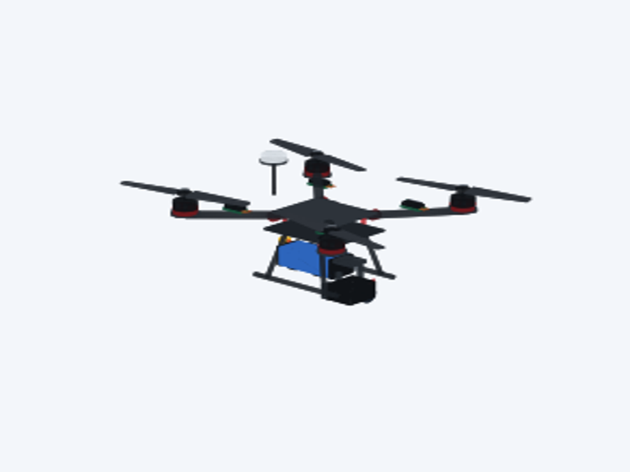
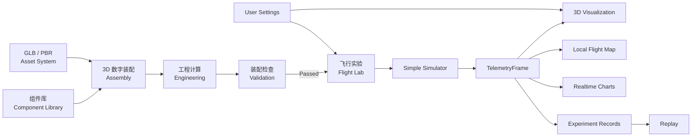
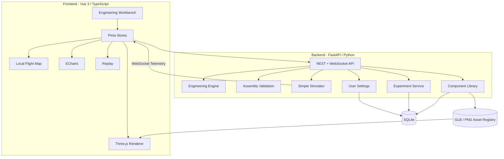

<div align="center">

# UAV Studio

### 无人机数字设计、3D 装配与飞行验证平台

**Design · Assemble · Validate · Fly · Analyze**

面向无人机工程教学与数字样机实验，将组件数据、3D 装配、工程计算、基础飞行验证与实验回放连接成一条完整链路。

</div>

<p align="center">
  
</p>

<p align="center">
  <strong>组件库 → 3D 数字装配 → 工程校核 → 飞行实验 → Local Flight Map → 数据分析 → Replay</strong>
</p>

---

## 为什么做 UAV Studio

很多无人机课程从“飞行操作”开始，而 UAV Studio 更关注一个更基础的问题：

> **一架无人机为什么能被正确地设计、组装并验证？**

项目希望让学生不只是“看到一架无人机”，而是能够从组件开始完成一架数字样机，并理解质量、重心、动力、电源、桨叶旋向、安装位置和飞行表现之间的关系。

UAV Studio 当前聚焦于三件事：

| 核心能力 | 目标 |
| --- | --- |
| **数字装配** | 从机架、电机、电调、螺旋桨、电池、飞控、GNSS、载荷开始构建整机 |
| **工程验证** | 用统一工程模型计算质量、CG、惯量、推重比、电流、功率、续航与兼容性 |
| **飞行实验** | 使用简化动力学、3D 场景、Local Flight Map、遥测曲线和 Replay 验证设计 |

---

## 当前效果

### Realistic EduQuad-650

UAV Studio 已从早期教学几何体升级到更完整的 **PBR / GLB 无人机数字样机资产体系**。

<p align="center">
  
</p>

当前整机由真实组件资产组合而成，包括：

- 碳纤维机架与连接结构；
- 5010 / 4008 无刷电机；
- ESC、MOSFET、散热与线束细节；
- 14 / 15 英寸 CW / CCW 螺旋桨；
- 6S LiPo 电池与接插件；
- 电源模块、飞控、GNSS；
- 云台相机任务载荷。

### 组件资产

<p align="center">
  
</p>

每个工程组件不仅包含质量和参数，也可以拥有独立的：

```text
Component
├── Engineering Parameters
├── Performance Curves
├── GLB Asset
├── Thumbnail
├── Visual Scale
└── Compatibility / Assembly Semantics
```

### 从教学模型到数字样机

<table>
<tr>
<td align="center" width="50%">
<b>3D Asset System V1.1</b><br><br>

</td>
<td align="center" width="50%">
<b>Realistic Edition</b><br><br>

</td>
</tr>
</table>

升级重点不是单纯增加面数，而是建立更加一致的尺寸、安装基准、PBR 材质、真实组件差异和可测试的 3D 资产契约。

---

## 3D 数字装配

装配页是 UAV Studio 当前最核心的交互。

```text
选择组件
   ↓
检查合法安装槽
   ↓
3D 模型装配
   ↓
工程参数重新计算
   ↓
装配检查
   ↓
进入飞行实验
```

支持的主要组件：

`Frame` · `Motor ×4` · `ESC ×4` · `Propeller ×4` · `Battery` · `Power Module` · `Flight Controller` · `GNSS` · `Payload`

### 爆炸视图

装配场景支持 **整机 / 爆炸视图** 切换。

爆炸视图将组件按工程层级展开：

- GNSS / Flight Controller 向上分层；
- Propeller / Motor / ESC 沿四个机臂向外展开；
- Battery / Power Module / Payload 向下展开；
- Frame 保持为装配基准；
- 组件仍可点击、选择和检查；
- 工程错误高亮与 M1–M4 安装位保持关联。

这使 Three.js 场景不仅是“模型展示器”，而是逐步成为一个轻量化的 **无人机数字装配工作台**。

---

## 产品闭环



这条链路的核心原则是：

> **同一份 AircraftDefinition 与 TelemetryFrame 驱动工程计算、3D、地图、图表、实验记录和 Replay。**

避免不同页面各自维护一套“看起来正确”的假数据。

---

## 系统架构



---

## 核心模块

### 1. 无人机装配

七步装配流程：

1. 机架
2. 动力系统
3. 供电系统
4. 飞控与导航
5. 任务载荷
6. 螺旋桨
7. 装配检查

支持 M1–M4 独立安装语义、CW / CCW 螺旋桨约束、3D 选中、高亮和工程问题定位。

### 2. 组件库

组件库与装配页面使用同一套组件数据。

可以浏览和维护：

- 工程参数；
- 性能曲线；
- 3D 资产；
- 缩略图；
- 适配关系；
- 教学故障组件。

组件变化可以直接影响整机装配和工程计算。

### 3. 工程计算

当前工程模型覆盖：

- 总质量；
- 重心 CG；
- 惯量估算；
- 单电机 / 总推力；
- 推重比；
- 悬停油门；
- 最大电流 / 功率；
- 电池持续放电能力；
- ESC / Power Module 电流裕量；
- 预计续航；
- 载荷质量比例；
- 电压兼容性；
- 电机 + 桨 + 电池性能曲线匹配。

### 4. 飞行实验

飞行状态机保持明确的安全顺序：

```text
Start
  ↓
Arm
  ↓
Takeoff
  ↓
Hover / Target / Wind
  ↓
Land
```

飞行实验包含：

- Three.js 3D 飞行；
- Local Flight Map；
- 实时遥测曲线；
- 风场输入；
- 目标位置 / 航点；
- 电池、功率和电机输出；
- 实验保存。

### 5. Experiment Replay

实验结束后可以读取同一份历史 `TelemetryFrame`：

```text
3D + Map + Charts
       ↑
   synchronized
       ↑
     Replay
```

用于复现实验过程，而不是重新随机生成动画。

---

## 技术栈

| Layer | Stack |
| --- | --- |
| Frontend | Vue 3 · TypeScript · Vite |
| UI | Element Plus |
| State | Pinia |
| 3D | Three.js · GLB / glTF 2.0 · PBR |
| Charts | ECharts |
| Backend | FastAPI · Pydantic |
| Engineering | NumPy + Python |
| Persistence | SQLAlchemy · SQLite |
| Realtime | WebSocket |
| Test | pytest · Vitest · Playwright contracts |

---

## 3D Asset Contract

所有 3D 组件通过统一 Asset Registry 管理。

```text
frontend/public/models/uav/v1_1/
├── asset_manifest.json
├── frame_650.glb
├── frame_450.glb
├── motor_5010_360kv.glb
├── motor_4008_500kv.glb
├── esc_30a.glb
├── ...
├── prop_15_cw.glb
├── prop_15_ccw.glb
└── thumbnails/
```

当前原则：

- 单位统一为 meter；
- 安装坐标统一；
- 模型缺失时 fail loudly；
- CW / CCW 使用独立资产；
- Component Visual Metadata 是正式数据契约；
- 3D 资产可被自动测试，而不是只靠肉眼检查。

---

## 快速开始

### Backend

```bash
python -m venv .venv

# Windows
.venv\Scripts\activate

# macOS / Linux
source .venv/bin/activate

pip install -r requirements.txt
uvicorn backend.main:app --reload
```

### Frontend

```bash
cd frontend
npm install
npm run dev
```

默认开发环境由 Vite 前端连接 FastAPI 后端。

---

## 测试

UAV Studio 使用 **docs-driven + test-first** 的开发方式。

### Backend

```bash
pytest
```

### Frontend

```bash
cd frontend

npm run test
npm run build

npm run test:p0:asset
npm run test:p0:ui
npm run test:p0:scene

npm run e2e
npm run e2e:flight
npm run e2e:flight-controls
npm run e2e:component-library
npm run e2e:settings
```

重点测试对象包括：

- Engineering calculation contracts；
- Assembly state / slot mapping；
- GLB asset contracts；
- 3D scene probe；
- Exploded View geometry；
- Flight state machine；
- Telemetry / Replay；
- Component Library；
- Settings persistence；
- E2E flight workflow。

---

## 项目结构

```text
uav-studio/
├── backend/
│   ├── engineering.py
│   ├── simulator.py
│   ├── simulation_manager.py
│   ├── component_library.py
│   └── ...
│
├── frontend/
│   ├── src/
│   │   ├── components/
│   │   ├── views/
│   │   ├── stores/
│   │   └── three/
│   └── public/models/uav/
│
├── tests/
├── docs/
├── tools/
└── prompts/
```

---

## 开发方法

UAV Studio 的目标不仅是完成软件，也希望形成一套适合 AI 时代工程教学的开发方法：

```text
Requirements
    ↓
Docs as Source of Truth
    ↓
Tests First
    ↓
AI-assisted Implementation
    ↓
Visual / Engineering Verification
    ↓
Reference Implementation
```

学生可以先依据文档独立实现，再与 Reference Implementation 对比，最后通过 PR 改进 3D、工程算法、UX、Replay、测试或文档。

---

## Roadmap

当前阶段的重点已经从“增加更多普通 Web 页面”转向 **3D Assembly / Digital Mockup**。

### Near-term

- [x] Component Visual Contract
- [x] Realistic GLB / PBR Asset System
- [x] Component Library
- [x] Settings
- [x] Exploded View
- [x] Exploded Component Labels
- [x] Flight Lab + Replay
- [ ] Mount Anchor / Connector Contract
- [ ] Constrained Drag + Snap Assembly
- [ ] Wiring / Connector Visualization
- [ ] Component Envelope & Collision Check
- [ ] Assembly Sequence Animation
- [ ] Aircraft Package Export

### Longer-term

UAV Studio 将保持“设计与验证”边界，并把更高层自主能力交给后续平台：

```text
UAV Studio
   │
   │ Aircraft Package
   ▼
Autonomy Studio
   │
   ▼
UAV Operations
```

---

## V1 边界

UAV Studio 当前明确不把以下内容塞进同一个产品：

- PX4
- Gazebo
- ROS2
- SLAM
- AI 视觉
- 复杂 3D 行业环境
- 巡检 / 搜救 / 作业业务系统

这些能力属于后续 **Autonomy Studio / UAV Operations**。

这样可以让 UAV Studio 始终专注于：

> **把飞机设计对、装配对，并验证它能正确飞行。**

---

## 文档

建议从以下文档开始：

- `docs/01_PRODUCT_DESIGN.md`
- `docs/02_TECHNICAL_DESIGN.md`
- `docs/03_COMPONENT_ASSEMBLY_SPEC_CN.md`
- `docs/05_DATA_CONTRACTS.md`
- `docs/06_TEST_PLAN.md`
- `docs/08_3D_ASSET_SYSTEM_V1_1.md`
- `docs/12_COMPONENT_LIBRARY_SPEC_CN.md`
- `docs/13_SYSTEM_SETTINGS_SPEC_CN.md`
- `docs/15_EXPLODED_VIEW_SPEC_CN.md`
- `docs/17_REALISTIC_ASSET_EDITION_CN.md`

---

<div align="center">

### UAV Studio

**From components to a flyable digital aircraft.**

</div>
